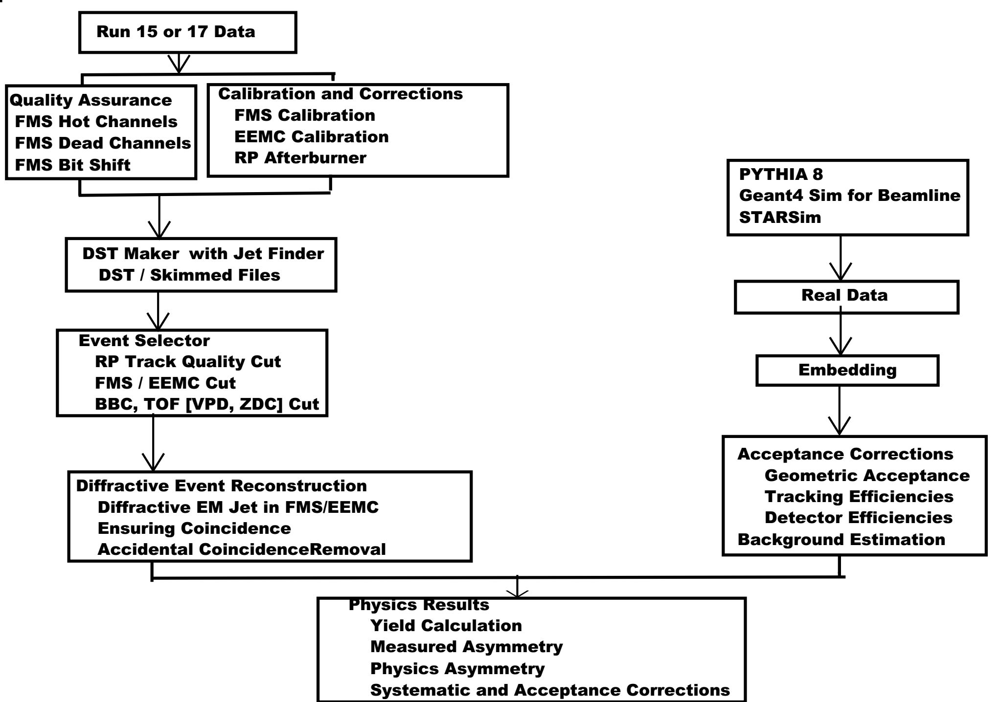

Diffractive EM-Jet A<sub>N</sub> at Forward Rapidities With FMS and EEMC
=====================================================================

**Motivation:**
- [UCR 2018 Proposal](https://drive.google.com/drive/folders/1X9isx8UUJv5uCBU-iLMtw54VqaNt92zA)
- [The RHIC Cold QCD Plan](https://arxiv.org/pdf/1602.03922.pdf) (See Diffraction) 
- [EIC White Paper](https://arxiv.org/pdf/1212.1701.pdf) (See Diffractive Physics)
- [Beam Use Request for Run 15-16]()


**Dataset:**
- Run 17 (Primarily) and Run 15 (Initially)
- Using Detectors FMS and EEMC with RP.

**Analysis Tools:**
- UCR Spin Analysis Tools Github repository: [BrightStar](https://github.com/latifkabir/BrightSTAR)

**Resources:**
- STAR Jet Reconstruction code: See the blog post [here](https://drupal.star.bnl.gov/STAR/blog/gdwebb/running-jet-code) 
- For Jet analysis, see related theses, for example:
  - [Grant Webb's thesis](https://drupal.star.bnl.gov/STAR/files/main_2.pdf) 
  - [Zilong's thesis](https://drupal.star.bnl.gov/STAR/system/files/Zilong_Chang_TAMU_Thesis.pdf)
  - [Kevin's thesis](https://drupal.star.bnl.gov/STAR/files/KevinAdkinsThesis_Final.pdf)
  - [Suvarna's thesis]
- [Chong's FMS Calibration Notes](https://drupal.star.bnl.gov/STAR/starnotes/private/psn0735)


**Workflow**

```
 Students Meeting ----> UCR Meeting ----> FMS Meeting -------> PWG Meeting -----> Working on
   	   /\ 	    	      	      	    			     	     	    feedback
     	   | 	    	      	      	    			     	     	    	|   
	   |				         					|
	   |____________________________________________________________________________|
	   	   

			     C++ (basic syntax)
				    |
				   \|/
			     Object Oriented C++ Programming
			     	    |
				   \|/
			     Linux Commands / Unix    
				    |
				   \|/
	     User Analysis<------- ROOT<-------------------------------------------------
				    |							|
				   \|/							|						
			       STAR Analysis (StRoot)-----------------> Generate DST ---|   
                                 
```




**Critical Concepts**

- Diffractive Events
- Jet Finding Algorithm
- Pileup or Accidental Background
- Underlying Events
- Unfolding

**Previous presentations:**

- [Diffractive jet basic study](https://drive.google.com/file/d/1FAP7NyflAx0lDKqFWk_NFi8_L_M2mF3h/view?usp=sharing) (12/07/2020, Note: EEMC is not correct)
- [FMS Hot Channel QA](https://drive.google.com/file/d/1QWTYkr4dsgWogJ9amSMzELmPnDHZq_Fu/view?usp=sharing) (01/22/2021)


**Exercises**

- Motivation

- Generate DST for EM-jets in FMS and EEMC

- Perform QA studies
   - Check if there is any hot/bad/dead FMS channels: Make jet y vs x plot for each fill
   - For the fills having hot areas, find the corresponding detector and channel ids and add the detector and channel ids to hot channels list
   - Once hot channels list is updated, generate EM-jet for that fill again and check if the hot area is gone.
   - Make a plot to show number of jets per run normalized by number of JP0 trigger: along x axis is the run number (or could be run index) and y axis plot number of em-jets nurmalized by number of JP0 trigger
   - EEMC Tower QA Studies
   - RP QA Studies

- Event Selection:
  - Complete list of cuts
  - Pileup or accidental events
  - Develop algorithm to remove pileup 


   
   
   


